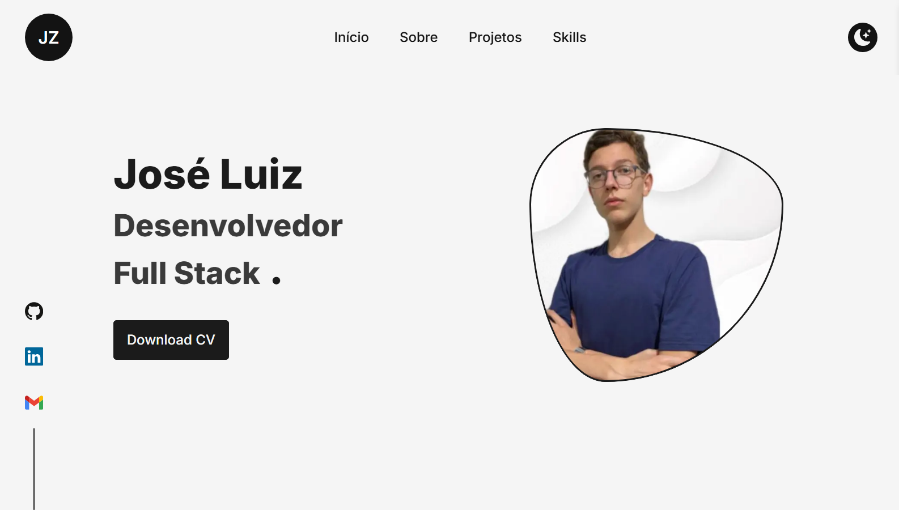

# 💼 Portfólio Pessoal — José Luiz

---

## 📋 Sobre o projeto

Este repositório contém o **meu portfólio pessoal como Desenvolvedor Full Stack**, onde apresento:

- Informações sobre mim e minha trajetória;
- Projetos reais que desenvolvi, incluindo aplicações públicas e sistemas privados;
- Tecnologias e ferramentas que utilizo no dia a dia;
- Experimentos visuais, animações e boas práticas de UI/UX.

O projeto foi originalmente baseado em um template open-source e **totalmente adaptado, refatorado e personalizado** por mim, tanto em layout quanto em conteúdo e estrutura.

---

## 🧑‍💻 Sobre mim

Meu nome é **José Luiz**, sou estudante de **Análise e Desenvolvimento de Sistemas** e atuo como **Desenvolvedor Full Stack**, com foco principal em aplicações web modernas.

Tenho experiência no desenvolvimento de:

- Aplicações Front-end com React e Next.js;
- Sistemas internos e dashboards empresariais;
- Integrações com APIs e back-end em Node.js;
- Interfaces modernas, responsivas e acessíveis.

---

## 🗂️ Projetos em destaque

Alguns projetos presentes no portfólio:

- **Duplo Controle Financeiro**  
  Aplicação web para organização financeira pessoal, com controle de ciclos de pagamento, receitas, gastos e caixinhas.  
  🔗 https://duplo-foco-financeiro.lovable.app/

- **Sistema Interno / Central de Operações**  
  Plataforma empresarial para centralização de consultas, rotinas administrativas e controles operacionais.  
  ⚠️ Projeto de uso privado (sem link público ou repositório).

- **Site Institucional / Portfólio Empresarial**  
  Projeto com layout moderno, foco em apresentação profissional e performance.  
  🔗 https://janailson.vercel.app/  
  💻 https://github.com/zzin742/graciano-grow-guide

---

## 🚀 Tecnologias utilizadas

- HTML5
- CSS3 / SASS
- JavaScript (ES6+)
- TypeScript
- React
- Next.js
- Tailwind CSS
- Framer Motion
- React Icons
- Node.js
- MongoDB / MySQL
- Git & GitHub

---